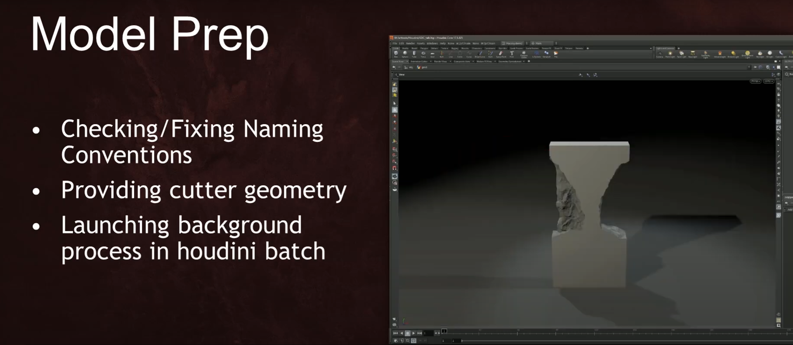
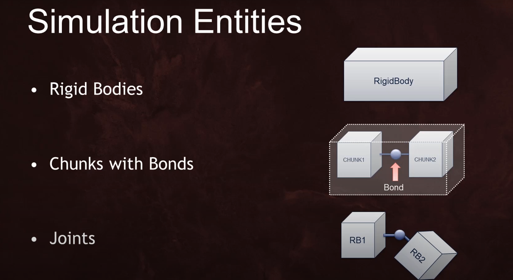
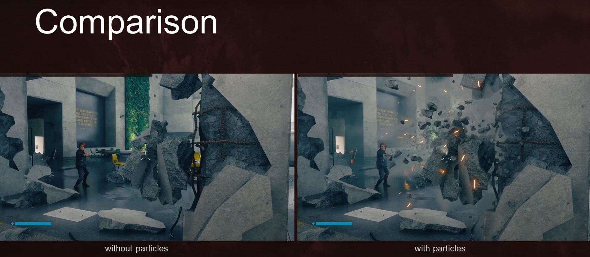
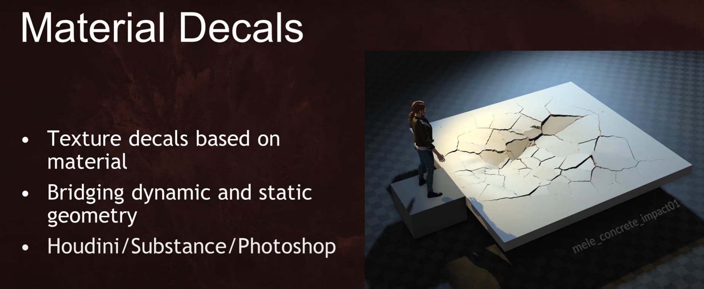

切割 产生破碎

得到断裂面

断裂面加钢筋等内部杂物

得到破碎模型 一级

得到破碎模型 二级

得到破碎模型 二级+内部杂物(钢筋)

最终

物理与铰链

粒子特效

粒子碰撞模拟用SDF（表面还存了法线）  这一步可以用屏幕空间深度图与法线图来做

加入粒子之后效果

粒子构成主要为 烟雾(扩散烟雾与下坠烟雾)、火花(高亮小光点 可与深度图交互(可选))、小石块(可与深度图做交互)

视差贴花 

