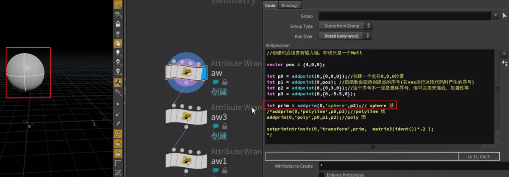
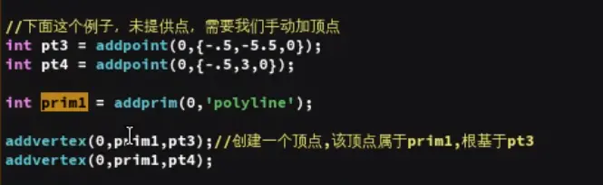
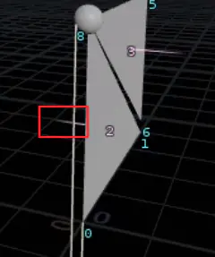

一、创建

- addpoint函数：创建点，并返回点的序号(也可以没有返回值)
1） 以p0为例子：输入端为0号输入端，添加一个顶点坐标为0，0，0的顶点，并返回顶点序号给p0

    

- addprim函数：创建基本几何体
    1. 输入端为0号输入端，在p2的位置创建一个球体

        

    2. 创造线的时候，需要给定两个位置点

        

    3. 创建面的时候，需要至少给定3个位置点，最多可以给定4个位置点，再多就需要用数组来

        

    4. 对prim这种基本几何体，它本身就是一个点，要想对他操作，需要使用setprimintrinsic函数：

        

- 输入端为0号，将球的几何体的transform属性修改为一个3x3矩阵，值为
0.2,0,0
0,0.2,0
0,0,0.2
也就是在原来的基础上，缩小到了0.2倍大小
- ident函数是一个4x4矩阵：
1，0，0，0
0，1，0，0
0，0，1，0
0，0，0，1
- matrix3函数：将matrix4类型的值转化为matrix3类型
- addpoint函数，还可以在第二个参数位置写一个序号
1. array函数：构建数组

    

2. addvertex函数：创建一个顶点

    

- 顶点必须要有寄托，不能凭空存在
二、修改
- setvertexpoint函数：修改顶点的住所（序号位置）
1）未修改前，2号面是逆时针，法线朝向背面

    

    2）修改了2号面的1、2号顶点之后，法线朝前a

    

三、删除

- removepoint函数：删除第几个输入端的第几号点

    

- removeprim函数：删除第几个输入端的第几号面（线），是否包括点也一起删除（第三个参数为0，则不包含点；否则包含点一起删除）
