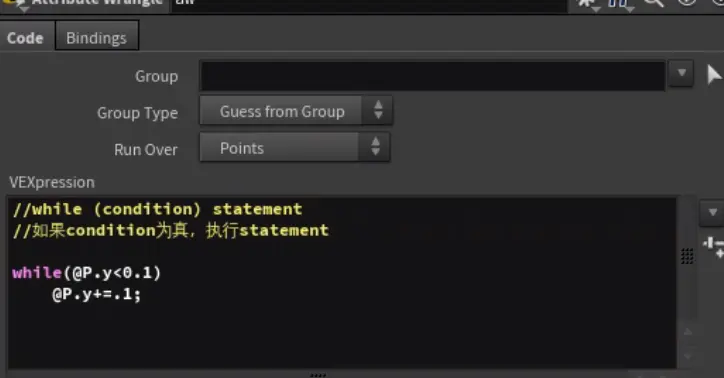
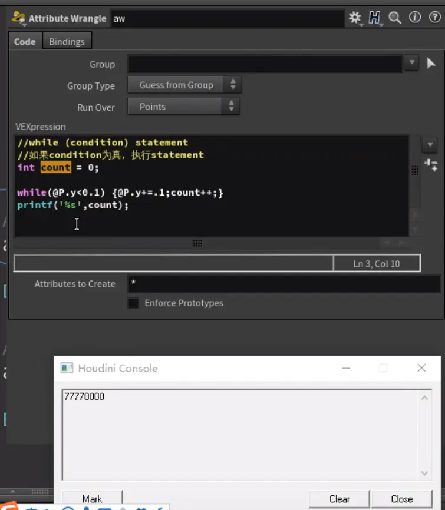
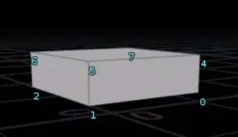
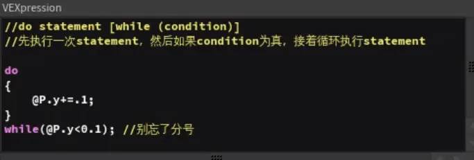
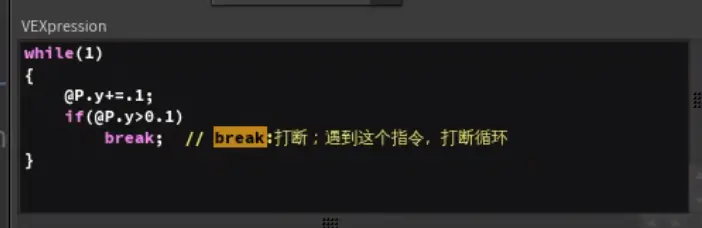
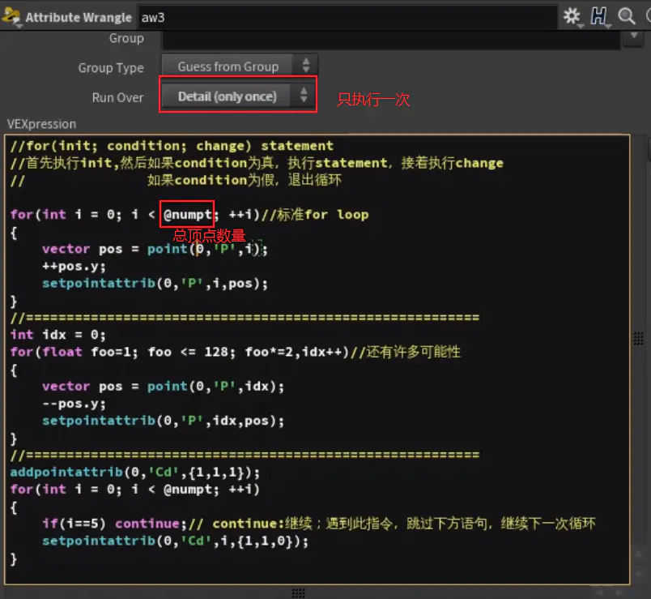

一、while循环语句

- attribute wrangle节点本身就是个循环：

    

- 一共是0-7号顶点，八个顶点，每个顶点执行一遍上面的while循环语句，满足条件的0123执行了七次，4567执行了0次，所以输出窗口是77770000

    

    二、do while循环语句

    

- 用while语句达到和do while语句相同的效果：

    

    三、for循环语句

    

- @numpt：总顶点数量
- point函数：读取点的属性，上图中是读取0号输入端的第i个顶点的位置属性
- continue：跳过下方语句，进入下一次循环
