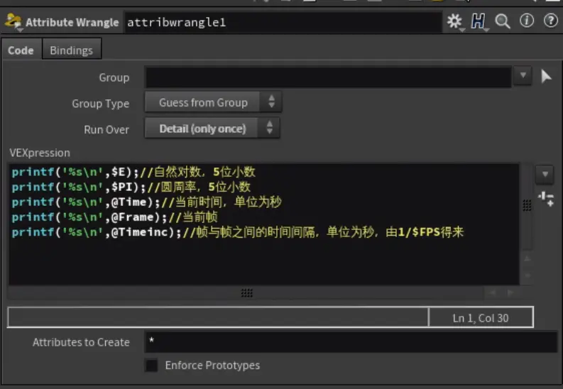

一、全局变量的定义：以 符号开头的变量如：E是自然对数，F是整数帧，FF是浮点帧，$FPS是帧速率

二、 如何在vex中获取全局变量

1. 有些是可以通过"$"获取的，有些不行：

    

- 这里有些可以有些不可以，比如$E可以，而当前帧就得用@Frame来获取

三、比较特殊的全局变量-仅仅在动力学当中才用得上

1. 简单的动力学网络：

    

2. 解算开始帧改为24帧：

    

3. 进入dopnet节点：

    

4. emptyobject节点用来存放动力学数据

    

5. 见了一个sopgeo节点，里面存放了一个box

1. 用geometrywrangle节点去解算它：

- 这种紫色节点是一种解算器：

    

7.使用multisolver节点去解算动力学对象：

    

1. @SimFrame：当前解算到了第几帧 （只能在动力学里面用）
- 把第一行注释去掉，移动到第24帧(因为咱们刚刚将解算开始帧设为第24帧)

    

- 在multisolver节点右键Spreadsheet...

    

- 找到sopgeo节点里的box：

    

- 可以看到box的y轴位置变为了2，因为我们把第24帧设为了开始的第一帧，所以当我们移动到第25帧时，也就是第二帧：

    

1. @SimTime：当前解算到了第几秒
- 点右下角可以更改帧率：

    

- 更改FPS为24：

    

- 查看：从24帧到48帧，刚好一秒钟时间（一帧是(1/FPS)秒，FPS=24，(48-24)/FPS=1秒）

    

1. @TimeInc：时间增量
- y值的计算：(62-36)_1/FPS,FPS=24,所以(62-36)_1/24=1.08333，每帧增加0.04
第36帧时：

    

    
第62帧时：

    
