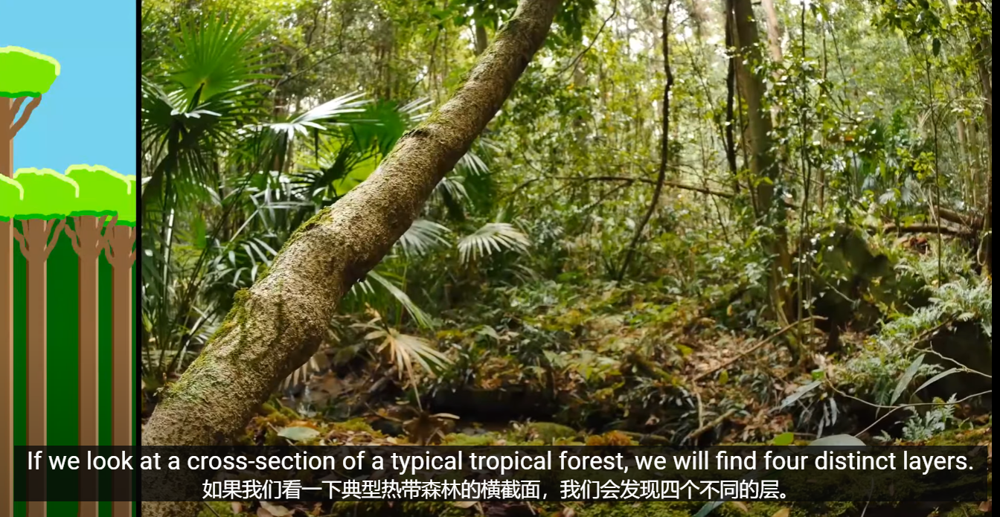
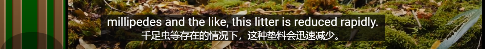

热带雨林植被特征。

说明地表单一，地表植被多样。

证明森林灌木较少，植被以阔叶为主。

随季节变化性森林

说明季节性森林到一定程度草原，地表由适当的灌木与草丛构成

Floor层==================================================

在下层，通常是由灌木和主要树种的幼苗构成，

Under Storey ======================================================

上层指20米到40米左右高度，拥有最多的物种多样性，主要体现在寄生树木的藤曼。但是最上层通常我们不太能注意到，我们只需要一个良好的树冠覆盖。

Canopy=======================================================

